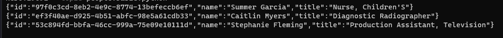

# Apache Kafka Research project

This repository is dedicated to studying and implementing various aspects of Apache Kafka.

## Project Structure

The project is organized into several main parts:

- admin-api
- avro-service
- consumer-api
- kafka-connect
- producer-api
- steam-processing

## Setup and Installation

Before running any components, ensure you have set up the `Docker` and loaded the dependencies from `requirements.txt`.

## Producer API

Located in the `producer-api` directory.

### Usage:
1. Create the Docker environment before executing `producer.py`.
2. The topic will be created on the first request if it doesn't exist.

To send a request:
```
Invoke-WebRequest -Method GET -Uri http://localhost:5000/
```
OR
```
curl -Method GET -Uri http://localhost:5000/
```

After that, run the following command to get the message to Kafka:
```
docker exec -it cli-tools kafka-console-consumer --bootstrap-server broker0:29092 --topic {topic_name}
```
Now that we are listening to the message, we can send the information to the consumer.
```
Invoke-WebRequest -Method POST -Uri http://localhost:5000/api/people -ContentType application/json -Body (@{"count"=3}|ConvertTo-Json)
```
If successful, you should see a response similar to the one shown in the picture below.



## Avro Service

Located in the `avro-service` directory.

For configuration details, refer to:
- [librdkafka Configuration](https://github.com/confluentinc/librdkafka/blob/master/CONFIGURATION.md)
- [Confluent Kafka Python Documentation](https://docs.confluent.io/platform/current/clients/confluent-kafka-python/html/index.html#schemaregistry-json-serializer)

### Usage:
1. Start the producer
2. Start the consumer
3. Make a request

## Kafka Connect
Located in the `kafka-connect` directory.

For more information on Kafka Connect Datagen, visit:
- [Kafka Connect Datagen GitHub](https://github.com/confluentinc/kafka-connect-datagen)

## Stream Processing

Located in the `stream-processing` directory. This component includes several subdirectories with files for processing tasks and demos.

- agents-demo
- building-table
- processing-complex-events
- producing-consuming
- task-demo

Also in `stream-processing` are using [faust](https://github.com/faust-streaming/faust). It's a stream processing library for building real-time data processing applications using Kafka.

## Additional Components
- `consumer-api`: Contains scripts for consuming Kafka messages.
- `admin-api`: Includes scripts for managing Kafka topics and configurations.

## Requirements
For a list of project dependencies, refer to the `requirements.txt` file in the root directory.

## Docker
The project uses Docker for containerization. Refer to `docker-compose.yml` for container configurations.

## Contributing
Please read the `.gitignore` file for details on which files are not tracked by version control.